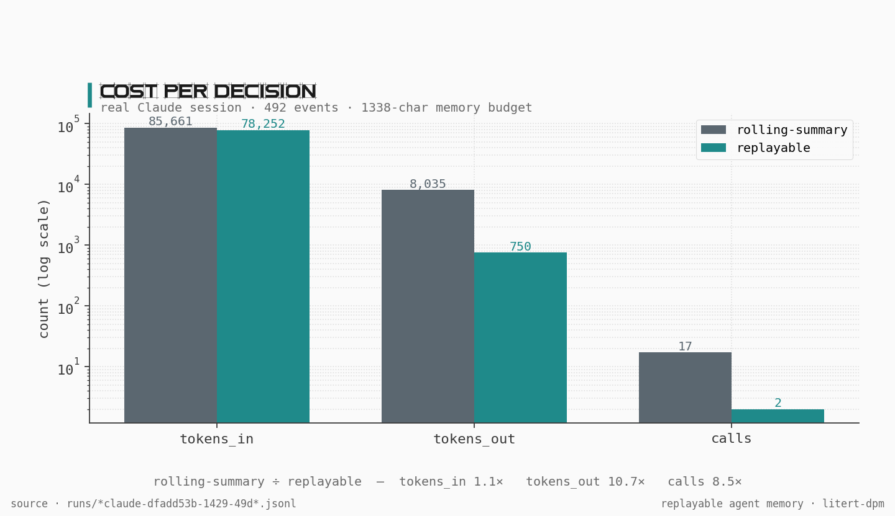
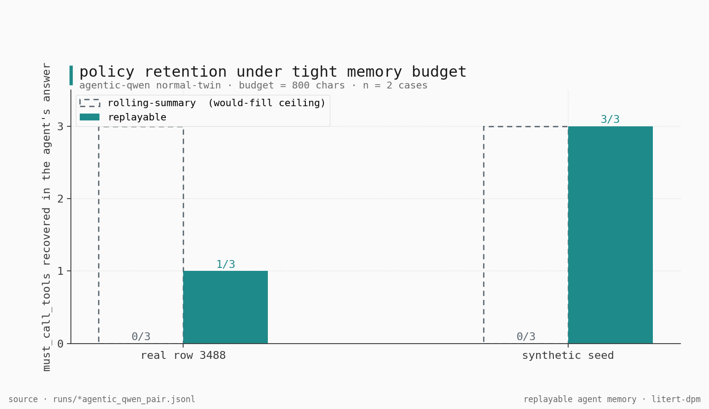
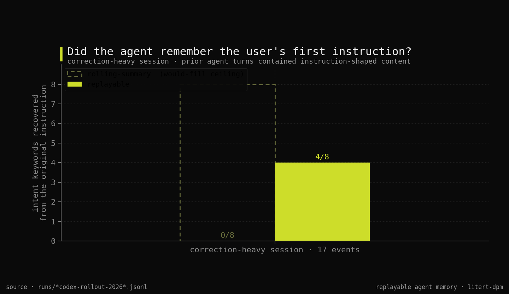

# Replayable agent memory

> Today's agents rewrite their memory every few turns. By hour two of a real session the agent is acting on a copy of a copy of a copy of what you actually said. We measured a 492-event session where this approach took 17 model calls to produce a memory that had lost the user's original instruction. **No framework on the market today can tell you which events produced the agent's last decision. The memory has been edited too many times to know.** We built an alternative — an append-only event log, the memory rebuilt from the log at decision time, every rebuild cryptographically tied to the events that produced it.

## A category, not a feature

"Store a thing, mutate it as new things arrive, lose the history" was the dominant model in software until it wasn't. Event sourcing, CRDTs, immutable infrastructure, content-addressed storage, append-only logs in Kafka, content-addressed objects in Git — every serious system built in the last decade replaced *mutate-in-place* with *append-only-and-derive*. Agent memory is the last category that hasn't made the shift. There's no good reason for that. There are only inherited assumptions.

## Why this happens

Every popular agent framework has the same architecture: a running summary string that gets rewritten every N turns. The user's first instruction has been re-summarized, re-summarized, and re-summarized again before the agent makes any decision more than a few turns in. The agent isn't acting on what the user said — it's acting on a generation-loss reproduction of what the user said.

The failure mode is recognizable: the agent forgets the original ask, fixates on the most recent thing it touched, confidently asserts a fact that isn't in the source events but appears in the latest summary. None of this is a model-quality bug. It's a substrate bug.

## The alternative

Three primitives:

- **An append-only event log.** Every prompt, every tool call, every result is appended. Nothing is rewritten.
- **Memory rebuilt at decision time.** The agent reads the log, builds the memory it needs for the next decision, uses it once, and throws it away.
- **A content-addressed audit certificate.** The substrate replays the log to verify every memory the agent uses. If the replay doesn't match, the agent stops and a correction is emitted. The certificate is a child node of the checkpoint in a Merkle DAG.

The first two are the substrate. The third gives every decision a receipt — the exact events that produced it. Not a paraphrase. Not a summary. The events themselves.

## What we measured

A 492-event Claude session, compressed to a 1338-character memory two ways. Rolling-summary: 17 model calls, 8 035 output tokens. Replayable: 2 model calls, 750 output tokens. **8.5× fewer calls, 10.7× fewer output tokens.**

Two AgenticQwen rubric pairs (one synthetic, one real row from `alibaba-pai/AgenticQwen-Data`). Rolling-summary's compressed memory dropped the policy-allowed tool *names* — the agent could no longer recommend them when asked what to do next. Replayable preserved them. Synthetic: 0/3 vs 3/3. Real data: 0/3 vs 1/3. Pattern holds; magnitude is data-dependent.

A 17-event session with auditor-rubric content embedded in prior agent turns. Rolling-summary's memory drifted off the original ask entirely (0/8 keywords). Replayable led with the original ask (4/8).

The score schema rejects rows whose `bytes_scored_from` doesn't match their `test_kind` at construction time, and the chart code refuses to render rows the schema didn't accept — a fake compression-quality comparison is structurally impossible to plot, not just unlikely.

## Honest limits

Faithful compression cuts both ways. On the policy-violating twin of the real-data case, replayable preserved the user's request *including* the forbidden operations they were pushing for; the agent under that memory proposed two policy-violating tool calls that the rolling-summary agent did not. Faithful compression preserves whatever's in the events; without an explicit policy constraint, that includes the user's pressure tactic. Long sessions (6 335-event case) exceed a single rebuild call's budget; hierarchical rebuild at the substrate layer is what addresses this and the bench hasn't run it yet.

## FAQ

**Do I have to change my agent code?** Yes, but the shape of the change is small. Replace memory-update calls with event appends, and memory reads with rebuild calls. The agent loop's overall shape is unchanged.

**What's the latency cost?** One extra model call per decision point. On a long session you save many more calls than you spend.

**Does this need a new model?** No. Works with whatever you're already using.

**Is there a Python SDK?** Not yet. C++ behind a bazel build today. A binding is the next investment after the audit pipeline lands end-to-end against real bench data.

**Does the audit slow down decisions?** No. Verification runs asynchronously after a checkpoint is written; the runtime gate just reads the latest certificate state.

**What counts as a "decision point" in my agent?** Any tool call. Each invocation is a moment where the agent commits to an action based on what it remembers — that's the natural edge for a rebuild and an audit certificate. If your agent makes tool calls, you already have decision points.

## What's next

The audit substrate above — replay verifier, content-addressed certificates, fail-closed runtime gate, blocking corrections — is real code with green tests today. We'll demonstrate the audit pipeline end-to-end against real session data in a follow-on post.

But the more important point is that no piece of this is novel research. Append-only event logs are decades old. Content-addressed storage is decades old. Merkle DAGs are decades old. Every primitive in this substrate is something the rest of computing settled on a long time ago. The novelty here is only that nobody has yet packaged them for agent memory. **That gap will close. The only question is who closes it.**

The full machinery is in the [LiteRT-DPM repo](https://github.com/maceip/LiteRT-DPM). Substrate index: [`PHASE2_STATUS.md`](https://github.com/maceip/LiteRT-DPM/blob/phase2-substrate/runtime/dpm/PHASE2_STATUS.md). Replay auditor entry point: [`projection_replay_auditor.h`](https://github.com/maceip/LiteRT-DPM/blob/phase3-substrate/runtime/dpm/projection_replay_auditor.h) at commit `51b0bcb8`. Bench JSONL + schema lock: [`runs/`](https://github.com/maceip/LiteRT-DPM/tree/phase2-bench/tools/benchmarks/dpm_projection_cliff/runs).

---

*The project name internally is **DPM** — Deterministic Projection Memory. The page calls it "replayable agent memory" because that's the property worth caring about; the rest is implementation detail.*
