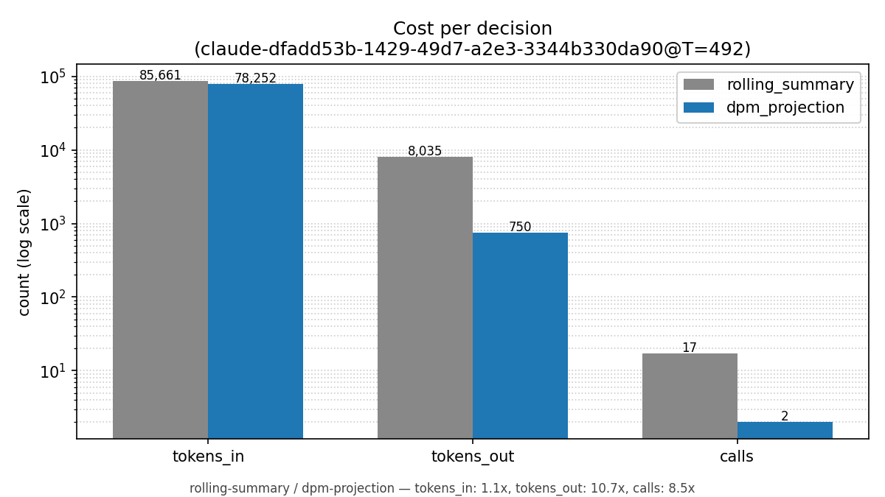

# Replayable agent memory

> Today's agents rewrite their memory every few turns. By hour two of a real session the agent is acting on a copy of a copy of a copy of what you actually said. We measured a 492-event session where this approach took 17 model calls to produce a memory that had lost the user's original instruction. **No framework on the market today can tell you which events produced the agent's last decision. The memory has been edited too many times to know.** We built an alternative — an append-only event log, the memory rebuilt from the log at decision time, every rebuild cryptographically tied to the events that produced it.

## A category, not a feature

The pattern of "store a thing, mutate it as new things arrive, lose the history" was the dominant model in software until it wasn't. Event sourcing, CRDTs, immutable infrastructure, content-addressed storage, append-only logs in Kafka, content-addressed objects in Git — every serious system built in the last decade replaced *mutate-in-place* with *append-only-and-derive*. Agent memory is the last category that hasn't made the shift. There is no good reason for this. There are only inherited assumptions.

## Why this happens

Every popular agent framework today has the same memory architecture: a running summary string that gets rewritten every N turns. The "memory" at any given moment is the output of the latest summarize call, which took the previous summary as input and produced a new one. That summary will become the input to the next summarize call. And the next.

Which means: the user's first instruction has been re-summarized, re-summarized, and re-summarized again before the agent makes any decision more than a few turns in. The agent isn't acting on what the user said. It's acting on a generation-loss reproduction of what the user said.

The failure mode this produces is recognizable. The agent forgets the original ask. The agent fixates on the most recent thing it touched. The agent confidently asserts a fact that isn't in the source events but appears in the latest summary. None of this is a model-quality bug. It's a substrate bug.

## What an alternative looks like

Three primitives:

**An append-only event log.** Every user turn, every tool call, every result is appended. Nothing is rewritten. The log is the source of truth for the entire session — and unlike a rolling summary, the log is the *full* truth, not a derivation of it.

**Memory rebuilt at decision time.** When the agent needs to act, it doesn't read a stored memory. It rebuilds the memory it needs from the event log: a single task-conditioned read over the log, executed once, used once, discarded. The memory the agent acts on is rebuilt every time, never edited.

**A content-addressed audit certificate.** Every rebuild produces a checkpoint. Replaying the raw log against the same model produces bytes that either hash-match the stored memory (verdict: pass) or don't (verdict: blocking correction emitted). The certificate is a child node of the checkpoint in a Merkle DAG. If the rebuilt memory drifts from what the events actually say, the runtime gate refuses the next decision until a fresh rebuild is taken.

The first two are the replayable-memory substrate. The third makes the memory *provably faithful* — every decision is bound to the specific events that produced it, not to a summary nobody can audit.

## What we measured

A 492-event Claude session, compressed to a 1338-character memory two ways:

- Rolling-summary: 17 model calls, 8 035 output tokens, original user instruction lost in the final memory.
- Replayable, with a single task-conditioned rebuild: 2 model calls, 750 output tokens, original instruction preserved.

**8.5× fewer calls, 10.7× fewer output tokens, better answer quality.**

Two AgenticQwen rubric-shaped twin pairs (one synthetic seed, one real row from `alibaba-pai/AgenticQwen-Data`). On the policy-allowed twin, rolling-summary's compressed memory dropped the policy-allowed tool *names* entirely — the agent could no longer recommend them when asked what to do next. The replayable memory preserved them. Synthetic seed: 0/3 vs 3/3. Real data: 0/3 vs 1/3. The pattern holds across both; the magnitude is data-dependent.

A 17-event session with auditor-rubric content embedded in prior agent turns. After hardening the rebuild prompt against instruction injection from event content, rolling-summary's memory had drifted entirely off the original ask (0/8 keywords retained from the user's first instruction). The replayable memory led with the original ask (4/8).

The benchmark methodology and the schema-locked JSONL are in the repo. The score schema rejects rows whose `bytes_scored_from` doesn't match their `test_kind` at construction time, and the chart code refuses to render rows the schema didn't accept — so a fake compression-quality comparison is structurally impossible to plot, not just unlikely.

## Honest limits

Faithful compression cuts both ways. On the policy-violating twin of one real-data case, the replayable memory faithfully preserved the user's request *including the forbidden operations* the user was pushing for. The agent under that memory proposed two policy-violating tool calls that the rolling-summary agent did not. Faithful compression preserves whatever is in the events; without an explicit policy constraint in the prompt, that includes the user's pressure tactic.

Long sessions beyond a single rebuild call. A 6 335-event case exceeds the input budget of one model call by ~6×. Hierarchical rebuild at the substrate layer — the same `Level0` + `DeltaAppend` codec that already exists in the C++ runtime — is what addresses this; the bench has not yet run it.

## FAQ

**Do I have to change my agent code?** Yes, but the shape of the change is small. Replace your memory-update calls with event appends, and your memory reads with rebuild calls. The agent loop's overall shape — read memory, decide, act, observe — is unchanged.

**What's the latency cost of rebuilding instead of caching?** One extra model call per decision point. On a long session you save many more calls than you spend, because you no longer pay the rolling-summary tax on every turn.

**Does this need a new model?** No. It works with whatever model you're already using. The substrate is model-agnostic — it cares about the bytes that come back, not the family that produced them.

**Is there a Python SDK?** Not yet. The substrate is C++ today, behind a bazel build. A Python binding is the next investment once the audit pipeline lands end-to-end against real bench data.

**Does the audit certificate slow down decisions?** No. Verification runs asynchronously after a checkpoint is written; the runtime gate at decision time just reads the latest certificate state and the correction index. Both are cheap lookups.

**What counts as a "decision point" in my agent?** Most easily: any tool call. Each tool invocation is a moment where the agent commits to an action based on what it remembers — that's the natural edge for a memory rebuild and an audit certificate. If your agent makes tool calls, you already have decision points; you just haven't been treating them that way.

## What's next

The audit substrate above — replay verifier, content-addressed certificates, fail-closed runtime gate, blocking corrections — is real code with green tests today. We will demonstrate the audit pipeline end-to-end against real session data in a follow-on post.

But the more important point is that no piece of this is novel research. Append-only event logs are decades old. Content-addressed storage is decades old. Merkle DAGs are decades old. Every primitive in this substrate is something the rest of computing settled on a long time ago. The novelty here is only that nobody has yet packaged them for agent memory. **That gap will close. The only question is who closes it.**

The full machinery is in the [LiteRT-DPM repo](https://github.com/maceip/LiteRT-DPM). Substrate index: [`runtime/dpm/PHASE2_STATUS.md`](https://github.com/maceip/LiteRT-DPM/blob/phase2-substrate/runtime/dpm/PHASE2_STATUS.md). Replay auditor entry point: [`runtime/dpm/projection_replay_auditor.h`](https://github.com/maceip/LiteRT-DPM/blob/phase3-substrate/runtime/dpm/projection_replay_auditor.h) at commit `51b0bcb8`. Bench JSONL + schema lock: [`tools/benchmarks/dpm_projection_cliff/runs/`](https://github.com/maceip/LiteRT-DPM/tree/phase2-bench/tools/benchmarks/dpm_projection_cliff/runs).

---

*The project name internally is **DPM** — Deterministic Projection Memory. The page calls it "replayable agent memory" because that's the property worth caring about; the rest is implementation detail.*
