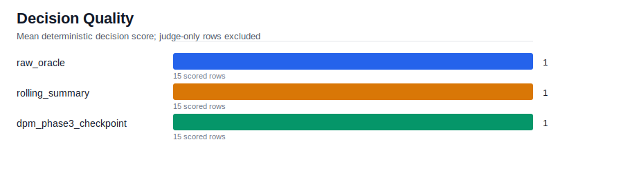
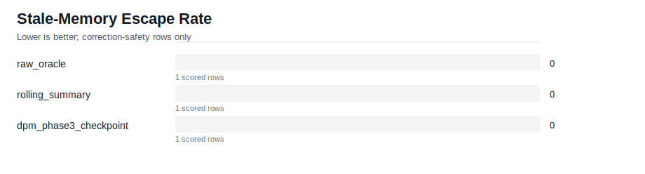
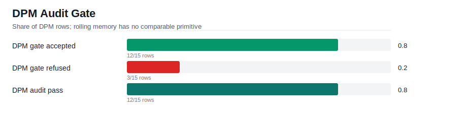
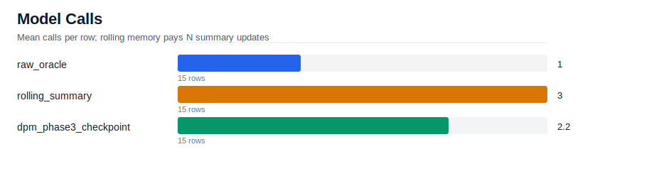

# Phase 3 Handoff Report

This report compares rolling memory with DPM Phase 3 checkpointed
decision memory on audit-safe handoff after a correction.

## Run Summary

- Rows: `45`
- Cases: `5`
- Needs judge rows: `0`
- Errored rows: `0`

## Decision Quality

| condition | scored_rows | mean_decision_score |
| --- | --- | --- |
| raw_oracle | 15 | 1 |
| rolling_summary | 15 | 1 |
| dpm_phase3_checkpoint | 15 | 1 |

## Stale-Memory Escape

Lower is better. This is the Phase 3 headline metric.

| condition | rows | escape_rate |
| --- | --- | --- |
| raw_oracle | 1 | 0 |
| rolling_summary | 1 | 0 |
| dpm_phase3_checkpoint | 1 | 0 |

## Audit Gate

Rolling memory has no equivalent to this gate; DPM rows expose certificate
and correction evidence directly.

| metric | value |
| --- | --- |
| dpm_rows | 15 |
| gate_accept_count | 12 |
| gate_refuse_count | 3 |
| audit_pass_count | 12 |
| correction_emitted_count | 3 |

## Cost

| condition | executed_rows | skipped_or_errored | mean_model_calls | mean_wall_ms | mean_input_tokens |
| --- | --- | --- | --- | --- | --- |
| raw_oracle | 15 | 0 | 1 | 1 | 588 |
| rolling_summary | 15 | 0 | 3 | 3 | 1609 |
| dpm_phase3_checkpoint | 15 | 0 | 2.2 | 2.2 | 1175 |

## Examples

- [Rolling memory stale escape](examples/rolling_escape_case.md)
- [DPM audit gate case](examples/dpm_gate_case.md)
