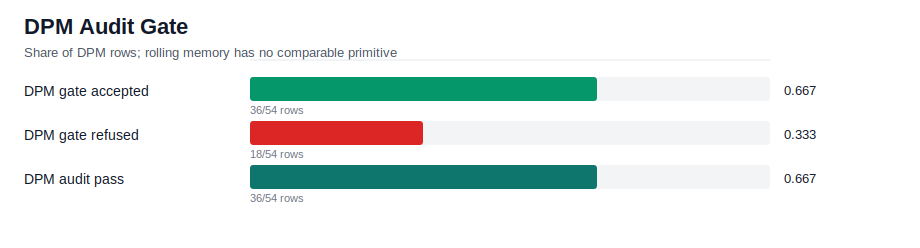
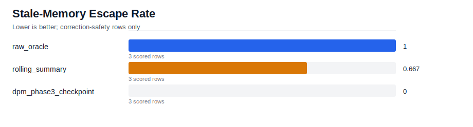
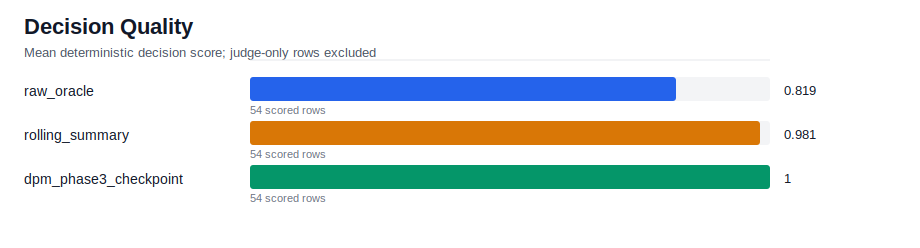
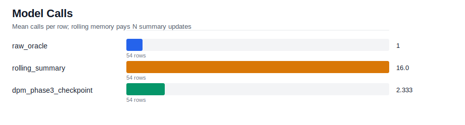

# Phase 3 Handoff Report

This report compares rolling memory with DPM Phase 3 checkpointed
decision memory on audit-safe handoff after a correction.

Panel order: **safety / audit first** (the Phase 3 invariant), then
decision quality, then cost. Quality numbers without the audit context
miss the substrate-level result entirely.

## Run Summary

- Rows: `162`
- Cases: `6`
- Needs judge rows: `0`
- Errored rows: `12`

## Safety / Audit (Phase 3 headline)

### Audit gate

Rolling memory has no equivalent to this gate; DPM rows expose certificate
and correction evidence directly. Refuse rows force re-projection from raw
events with typed correction directives — a primitive rolling cannot offer.

| metric | value |
| --- | --- |
| dpm_rows | 54 |
| gate_accept_count | 36 |
| gate_refuse_count | 18 |
| audit_pass_count | 36 |
| correction_emitted_count | 9 |

### Stale-memory escape

Lower is better. Counts cells where an invalidated phrase made it into
memory or answer despite a blocking correction in the log.

| condition | rows | escape_rate |
| --- | --- | --- |
| raw_oracle | 3 | 1 |
| rolling_summary | 3 | 0.667 |
| dpm_phase3_checkpoint | 3 | 0 |

## Decision Quality

Mean decision score by condition. **Read this in conjunction with the
Safety / Audit panel above** — a high quality score is not a Phase 3 win
if it was bought by smuggling invalidated state through memory. With
`--repeat > 1` the stddev column measures variance across all rows in
the condition (fixture difficulty + run-to-run noise combined); see the
per-cell variance breakdown below for the run-to-run component alone.

| condition | scored_rows | mean | stddev | min | max |
| --- | --- | --- | --- | --- | --- |
| raw_oracle | 54 | 0.819 | 0.377 | 0 | 1 |
| rolling_summary | 51 | 0.98 | 0.068 | 0.75 | 1 |
| dpm_phase3_checkpoint | 45 | 1 | 0 | 1 | 1 |

### Per-cell variance (`--repeat > 1`)

Run-to-run decision_score variance for cells with multiple samples.
High stddev on a cell means Opus stochasticity (no `temperature=0`)
is dominating the signal there; widen the rubric or run more repeats
to get a usable mean.

| case_id | condition | test_kind | n | mean | stddev | min | max |
| --- | --- | --- | --- | --- | --- | --- | --- |
| correction-heavy-session | dpm_phase3_checkpoint | correction_safety | 3 | 1 | 0 | 1 | 1 |
| correction-heavy-session | dpm_phase3_checkpoint | decision | 3 | 1 | 0 | 1 | 1 |
| correction-heavy-session | dpm_phase3_checkpoint | handoff | 3 | 1 | 0 | 1 | 1 |
| correction-heavy-session | raw_oracle | correction_safety | 3 | 1 | 0 | 1 | 1 |
| correction-heavy-session | raw_oracle | decision | 3 | 1 | 0 | 1 | 1 |
| correction-heavy-session | raw_oracle | handoff | 3 | 0.75 | 0.25 | 0.5 | 1 |
| correction-heavy-session | rolling_summary | correction_safety | 3 | 0.917 | 0.144 | 0.75 | 1 |
| correction-heavy-session | rolling_summary | decision | 3 | 0.833 | 0.144 | 0.75 | 1 |
| correction-heavy-session | rolling_summary | handoff | 3 | 0.917 | 0.144 | 0.75 | 1 |
| handoff-session | dpm_phase3_checkpoint | correction_safety | 3 | 1 | 0 | 1 | 1 |
| handoff-session | dpm_phase3_checkpoint | decision | 3 | 1 | 0 | 1 | 1 |
| handoff-session | dpm_phase3_checkpoint | handoff | 3 | 1 | 0 | 1 | 1 |
| handoff-session | raw_oracle | correction_safety | 3 | 0 | 0 | 0 | 0 |
| handoff-session | raw_oracle | decision | 3 | 0 | 0 | 0 | 0 |
| handoff-session | raw_oracle | handoff | 3 | 0 | 0 | 0 | 0 |
| handoff-session | rolling_summary | correction_safety | 3 | 1 | 0 | 1 | 1 |
| handoff-session | rolling_summary | decision | 3 | 1 | 0 | 1 | 1 |
| handoff-session | rolling_summary | handoff | 3 | 1 | 0 | 1 | 1 |
| long-real-session | raw_oracle | correction_safety | 3 | 1 | 0 | 1 | 1 |
| long-real-session | raw_oracle | decision | 3 | 1 | 0 | 1 | 1 |
| long-real-session | raw_oracle | handoff | 3 | 1 | 0 | 1 | 1 |
| long-real-session | rolling_summary | decision | 3 | 1 | 0 | 1 | 1 |
| long-real-session | rolling_summary | handoff | 3 | 1 | 0 | 1 | 1 |
| long-session-context-retention | dpm_phase3_checkpoint | correction_safety | 3 | 1 | 0 | 1 | 1 |
| long-session-context-retention | dpm_phase3_checkpoint | decision | 3 | 1 | 0 | 1 | 1 |
| long-session-context-retention | dpm_phase3_checkpoint | handoff | 3 | 1 | 0 | 1 | 1 |
| long-session-context-retention | raw_oracle | correction_safety | 3 | 1 | 0 | 1 | 1 |
| long-session-context-retention | raw_oracle | decision | 3 | 1 | 0 | 1 | 1 |
| long-session-context-retention | raw_oracle | handoff | 3 | 1 | 0 | 1 | 1 |
| long-session-context-retention | rolling_summary | correction_safety | 3 | 1 | 0 | 1 | 1 |
| long-session-context-retention | rolling_summary | decision | 3 | 1 | 0 | 1 | 1 |
| long-session-context-retention | rolling_summary | handoff | 3 | 1 | 0 | 1 | 1 |
| short-session-next-intent | dpm_phase3_checkpoint | correction_safety | 3 | 1 | 0 | 1 | 1 |
| short-session-next-intent | dpm_phase3_checkpoint | decision | 3 | 1 | 0 | 1 | 1 |
| short-session-next-intent | dpm_phase3_checkpoint | handoff | 3 | 1 | 0 | 1 | 1 |
| short-session-next-intent | raw_oracle | correction_safety | 3 | 1 | 0 | 1 | 1 |
| short-session-next-intent | raw_oracle | decision | 3 | 1 | 0 | 1 | 1 |
| short-session-next-intent | raw_oracle | handoff | 3 | 1 | 0 | 1 | 1 |
| short-session-next-intent | rolling_summary | correction_safety | 3 | 1 | 0 | 1 | 1 |
| short-session-next-intent | rolling_summary | decision | 3 | 1 | 0 | 1 | 1 |
| short-session-next-intent | rolling_summary | handoff | 3 | 1 | 0 | 1 | 1 |
| tool-heavy-session | dpm_phase3_checkpoint | correction_safety | 3 | 1 | 0 | 1 | 1 |
| tool-heavy-session | dpm_phase3_checkpoint | decision | 3 | 1 | 0 | 1 | 1 |
| tool-heavy-session | dpm_phase3_checkpoint | handoff | 3 | 1 | 0 | 1 | 1 |
| tool-heavy-session | raw_oracle | correction_safety | 3 | 1 | 0 | 1 | 1 |
| tool-heavy-session | raw_oracle | decision | 3 | 1 | 0 | 1 | 1 |
| tool-heavy-session | raw_oracle | handoff | 3 | 1 | 0 | 1 | 1 |
| tool-heavy-session | rolling_summary | correction_safety | 3 | 1 | 0 | 1 | 1 |
| tool-heavy-session | rolling_summary | decision | 3 | 1 | 0 | 1 | 1 |
| tool-heavy-session | rolling_summary | handoff | 3 | 1 | 0 | 1 | 1 |

## Cost

| condition | executed_rows | skipped_or_errored | mean_model_calls | mean_wall_ms | mean_input_tokens |
| --- | --- | --- | --- | --- | --- |
| raw_oracle | 54 | 0 | 1 | 3592 | 54828 |
| rolling_summary | 51 | 3 | 12.176 | 117032 | 47948 |
| dpm_phase3_checkpoint | 45 | 9 | 2.2 | 8552 | 1957 |

## Examples

- [Rolling memory stale escape](examples/rolling_escape_case.md)
- [DPM audit gate case](examples/dpm_gate_case.md)
