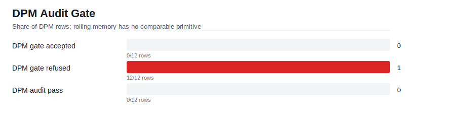
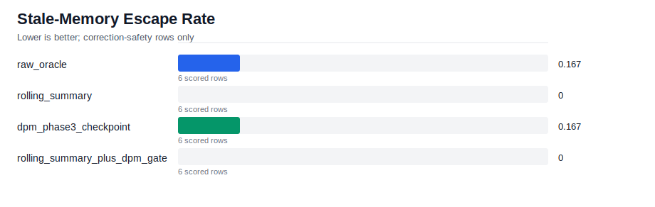
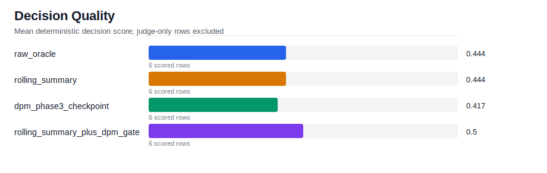
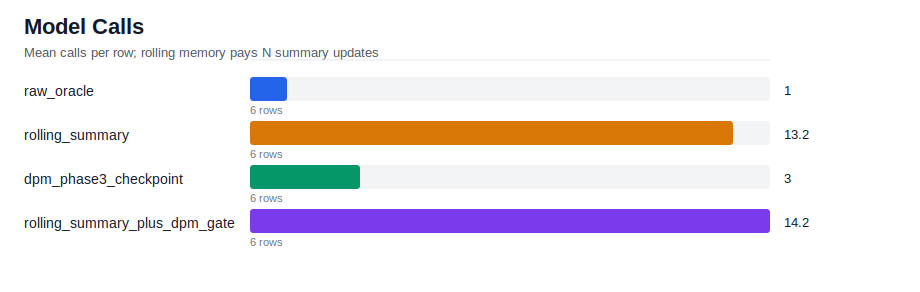

# Phase 3 Handoff Report

This report compares rolling memory with DPM Phase 3 checkpointed
decision memory on audit-safe handoff after a correction.

Panel order: **safety / audit first** (the Phase 3 invariant), then
decision quality, then cost. Quality numbers without the audit context
miss the substrate-level result entirely.

## Run Summary

- Rows: `24`
- Cases: `6`
- Needs judge rows: `0`
- Errored rows: `0`

## Safety / Audit (Phase 3 headline)

### Audit gate

Rolling memory has no equivalent to this gate; DPM rows expose manifest
fingerprints and correction evidence directly. Refuse rows force
re-projection from raw events with typed correction directives — a
primitive rolling cannot offer.

Manifest-fingerprint and audit-certificate fields on Python bench rows
are SHA-256 hashes computed at row-emit time (`memory_agents.sha256_hex`),
mirroring substrate semantics. The substrate's actual BLAKE3 ledger
(`LocalFilesystemAuditLedger`) is exercised by `phase3_substrate_smoke.cc`;
the Python matrix does not flow rows through it. Treat ledger-cert claims
for these rows as substrate-equivalent in shape, not in provenance.

| metric | value |
| --- | --- |
| dpm_rows | 12 |
| gate_accept_count | 0 |
| gate_refuse_count | 12 |
| audit_pass_count | 0 |
| correction_emitted_count | 12 |

### Stale-memory escape

Lower is better. Counts cells where an invalidated phrase made it into
memory or answer despite a blocking correction in the log.

| condition | rows | escape_rate |
| --- | --- | --- |
| raw_oracle | 6 | 0.167 |
| rolling_summary | 6 | 0 |
| dpm_phase3_checkpoint | 6 | 0.167 |
| rolling_summary_plus_dpm_gate | 6 | 0 |

## Decision Quality

Mean decision score by condition. **Read this in conjunction with the
Safety / Audit panel above** — a high quality score is not a Phase 3 win
if it was bought by smuggling invalidated state through memory. With
`--repeat > 1` the stddev column measures variance across all rows in
the condition (fixture difficulty + run-to-run noise combined); see the
per-cell variance breakdown below for the run-to-run component alone.

| condition | scored_rows | mean | stddev | min | max |
| --- | --- | --- | --- | --- | --- |
| raw_oracle | 6 | 0.444 | 0.086 | 0.333 | 0.5 |
| rolling_summary | 6 | 0.444 | 0.086 | 0.333 | 0.5 |
| dpm_phase3_checkpoint | 6 | 0.417 | 0.23 | 0 | 0.667 |
| rolling_summary_plus_dpm_gate | 6 | 0.5 | 0.105 | 0.333 | 0.667 |

## Cost

| condition | executed_rows | skipped_or_errored | mean_model_calls | mean_wall_ms | mean_input_tokens |
| --- | --- | --- | --- | --- | --- |
| raw_oracle | 6 | 0 | 1 | 9610 | 18855 |
| rolling_summary | 6 | 0 | 13.167 | 29357 | 21928 |
| dpm_phase3_checkpoint | 6 | 0 | 3 | 21658 | 38077 |
| rolling_summary_plus_dpm_gate | 6 | 0 | 14.167 | 28474 | 41348 |

## Examples

- [Rolling memory stale escape](examples/rolling_escape_case.md)
- [DPM audit gate case](examples/dpm_gate_case.md)
